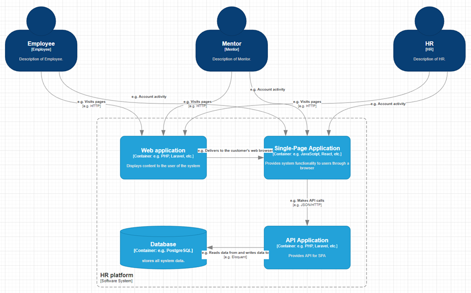

# hr-platform

## Функциональные требования

1. Возможность авторизации и регистрации
2. Возможность выбрать одно направление развития для сотрудника
3. Возможность назначить ментора сотруднику
4. Возможность создавать курсы и задачи
5. Возможность у ментора назначить задачи или курсы для сотрудника
6. Возможность у ментора просматривать прогресс сотрудников на курсах
7. Возможность добавлять материалы для изучения сотруднику
8. Возможность HR просматривать сотрудников
9. Возможность менторов просматривать сотрудников
10. Возможность ведения переписки между менторами / сотрудниками / HR
11. Возможность сотрудников просматривать менторов
12. Возможность просматривать сотрудников по направлениям

## Нефункциональные требования

1. Система должна работать 24/7
2. Платформа должна загружаться не дольше 1 секунды
3. Формат даты должен быть следующим : ДД.ММ.ГГГГ
4. Система может быть недоступна не более 5 часов в год (SLA = 99.95%)
5. 95% пользователей должны быть способны использовать 70% функций системы не более чем через 6 часов обучения.

## Системные требования

1. Необходимо логирование всех запросов
2. Необходим бэкап базы данных раз в сутки
3. Манипулирование данными в базе данных должно осуществляться через ORM

## C4

### Уровень контекста

### Уровень контейнеров

### Уровень компонентов

### Уровень кода

## Sequence diagram

## SLA

|                                                                                                    | Низкий | Средний | Высокий |
|----------------------------------------------------------------------------------------------------|--------|---------|---------|
| Поддержка системы                                                                                  | 24/7   | 24/7    | 24/7    |
| Установка обновлений в СУБД                                                                        | +      | +       | +       |
| Максимальное время ожидания ответа                                                                 | 24 ч   | 8 ч     | 2 ч     |
| Бесплатное изменение настроек маршрутизаторов, не предусмотренных функционалом, согласованным в ТЗ | -      | -       | +       |
| Резервное копирование БД по запросу                                                                | -      | +       | +       |
